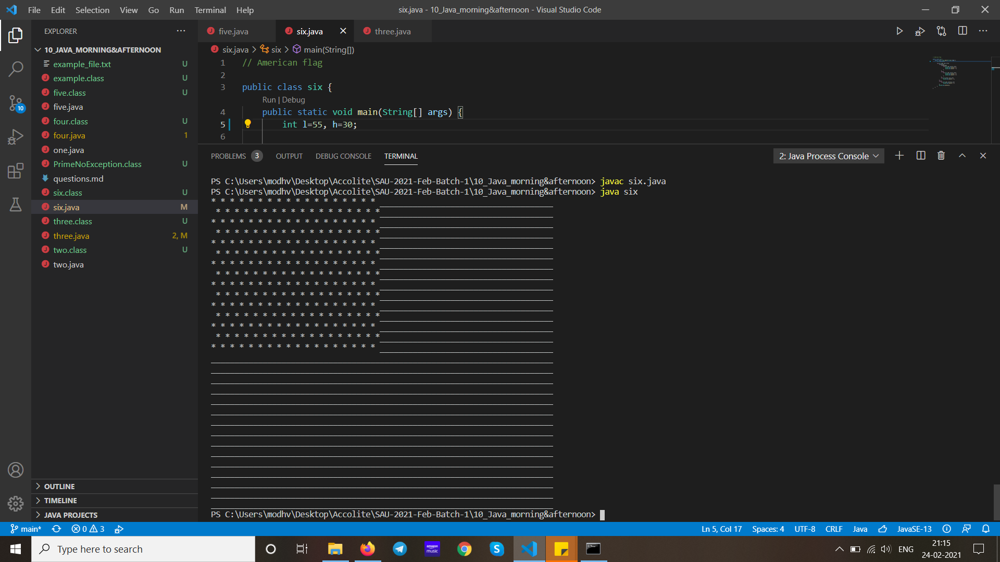

<h1> Questions: </h1>

1 String Write a Java program to replace each substring of a given string that matches the given regular expression with the given replacement.

2 Collection Write a Java program to get a reverse order view of the keys contained in a given map

3 Exception Write your own unchecked Exception and throw it from you counter programme which counts 1 to 100.When you get Prime no while counting then throw this Exception and catch this to print you exception message.

4 Serialization Write a programme to serialize 3 fields out of 5 and deserialize it. Use UUID to prvent object mutation.

5 Write a Java program to print the result of the following operations: 
a)-5 + 8 * 6  
b) (55+9) % 9  
c) 20 + -35 / 8  
d) 5 + 15 /32-8 % 3  

6 Write a Java program to print an American flag on the screen.

<h2>   Screenshots:   </h3>
 </img>    
 </img>   
 </img>  
 </img>  
 </img>  
 </img>  
