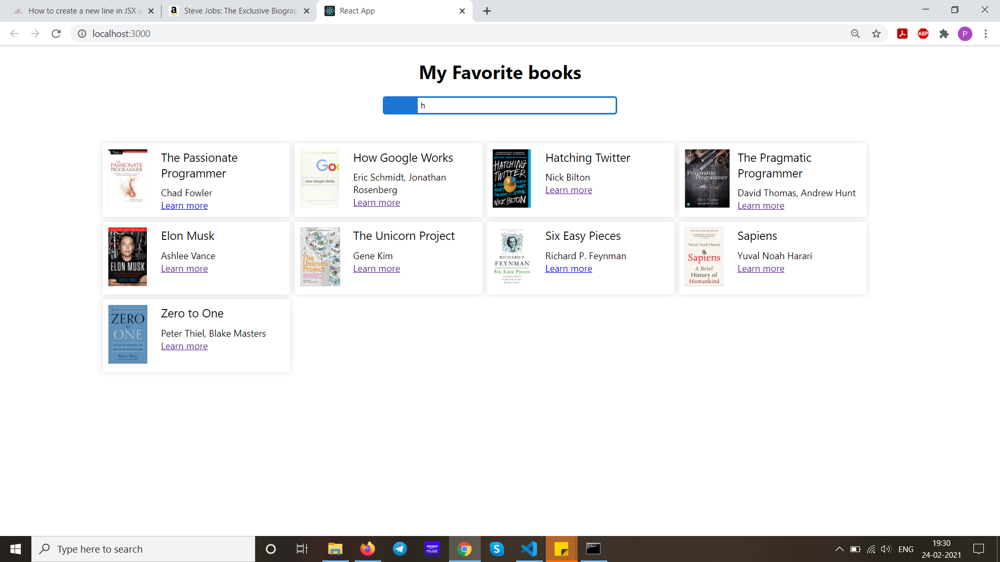

<h1>Question</h1>
Create an app that will show a list of books available in a store.
List items and when user click user should navigate to new route where user can see the details of book(name,author,etc). 
Add a search functionality.

<h2>   Prerequisite: </h3>
Please install <a href="https://fusejs.io/">fuse</a> by pasting the following command:
npm install fuse.js 

<h2>   Screenshots:   </h3>
 </img>    
 </img>   
 </img>  
 </img>  
 </img>  
 </img>  
 </img>  
 </img>  
 </img>  
 </img>  
